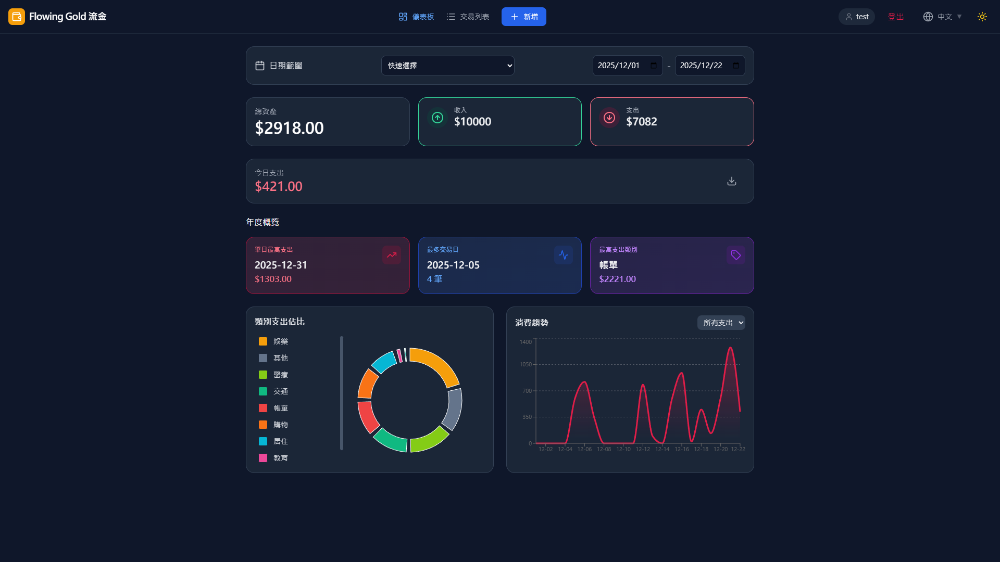

# Flowing Gold (流金) 💰

**Flowing Gold** is a beautiful, modern, and privacy-focused personal expense tracker application. It empowers you to manage your finances locally with a stunning React frontend and a robust Python FastAPI backend, now featuring **secure multi-user authentication**.



## ✨ Key Features

*   **🔐 Secure Authentication**: Integrated Registration and Login system to keep your data protected.
*   **👥 Multi-User Isolation**: Every user gets their own dedicated SQLite database (e.g., `username.db`), ensuring complete data privacy and isolation.
*   **🌍 Multi-language Support**: Fully localized in **English**, **Traditional Chinese (繁體中文)**, **Japanese (日本語)**, and **Korean (한국어)**.
*   **📊 Interactive Dashboard**: Visualize your finances with dynamic **Pie Charts** (Expenses by Category) and **Area Charts** (Consumption Trend). Includes data-aware placeholders and smooth error handling.
*   **📱 Responsive & Mobile-First**: A seamless experience across devices. The header automatically optimizes for mobile (icon-only modes), ensuring vital features are always reachable.
*   **🌗 Dark Mode**: Built-in toggle for Light and Dark themes.
*   **📅 Advanced Filtering**: Analyze spending by custom date ranges or quick presets.
*   **📝 Transaction Management**:
    *   Easily add income and expenses with a built-in calculator (e.g., input `50+20`).
    *   Paginated transaction list with custom rows per page.
    *   Delete records with safety confirmation (Long-press delete on mobile).
*   **📈 Yearly Statistics**: Deep insights into your highest spending days, most frequent transaction days, and top categories.
*   **� Modern Notifications**: Custom-built **Toast Notification** system replacing browser alerts for a premium user experience.
*   **📂 CSV Export**: Export your data anytime for external analysis.

## 🛠️ Tech Stack

*   **Frontend**:
    *   [React](https://react.dev/) + [TypeScript](https://www.typescriptlang.org/)
    *   [Vite](https://vitejs.dev/) - Blazing fast build tool
    *   [Tailwind CSS](https://tailwindcss.com/) - Utility-first styling
    *   [Recharts](https://recharts.org/) - Data visualization
    *   [Lucide React](https://lucide.dev/) - Premium iconography
*   **Backend**:
    *   [Python](https://www.python.org/) (3.8+)
    *   [FastAPI](https://fastapi.tiangolo.com/) - Modern, high-performance web framework
    *   [SQLAlchemy](https://www.sqlalchemy.org/) - SQL Toolkit and ORM
    *   [SQLite](https://www.sqlite.org/) - Lightweight, user-specific disk-based databases

---

## 🚀 Getting Started

Follow these steps to get a local copy up and running.

### Prerequisites

*   Node.js & npm
*   Python 3.8+

### Installation

1.  **Clone the repository**
    ```bash
    git clone https://github.com/yourusername/flowing-gold.git
    cd flowing-gold
    ```

2.  **Backend Setup**
    Navigate to the project root and install Python dependencies:
    ```bash
    pip install -r backend/requirements.txt
    ```

3.  **Frontend Setup**
    Install Node.js dependencies:
    ```bash
    npm install
    ```

### 🗄️ Database Logic

The app manages databases dynamically:
*   **`expenses.db`**: Stores the global user registry (usernames and passwords).
*   **`{username}.db`**: Once logged in, a private database is automatically created for each user to store their transactions.

### ▶️ Running the Application

You need to run both the backend and frontend servers.

**1. Start the Backend Server**
Open a terminal and run:
```bash
# Windows
python -m uvicorn backend.main:app --reload

# Mac/Linux
python3 -m uvicorn backend.main:app --reload
```
*The backend API will be available at `http://127.0.0.1:8000`*

**2. Start the Frontend Application**
Open a second terminal and run:
```bash
npm run dev
```
*Open the link shown (typically `http://localhost:3000`) in your browser to start tracking!*

---

## 💡 Usage Tips

*   **Multi-User**: Register a new account to see how the app creates a fresh, empty database just for you.
*   **Calculator Input**: In the amount field, you can type expressions like `120*2` or `50+30-10`.
*   **Mobile Experience**: On mobile devices, the login/user section collapses into a clean icon-only view. Long-press any transaction to trigger the delete prompt.

## 📄 License

Distributed under the MIT License. See `LICENSE` for more information.

---

Made with ❤️ by Flowing Gold Team
